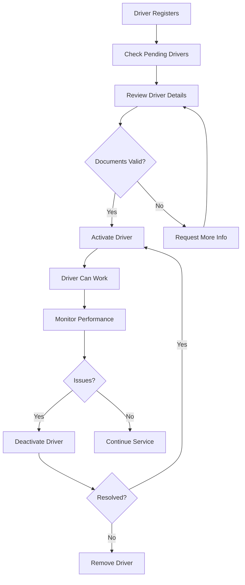

# 🚗 Run-Run Driver Management Guide

**Complete Guide for Activating, Viewing, Deactivating, and Removing Drivers**

**Project:** Run-Run Guinea-Bissau Ride-Sharing Platform  
**Date:** December 20, 2025  
**Developer:** Edivaldo Cardoso  
**Backend API:** https://zippy-healing-production-24e4.up.railway.app/api

---

## 📋 Table of Contents

1. [Overview](#overview)
2. [Admin Authentication](#admin-authentication)
3. [Activate Driver](#activate-driver)
4. [View Drivers](#view-drivers)
5. [Deactivate Driver](#deactivate-driver)
6. [Remove Driver](#remove-driver)
7. [Database Queries](#database-queries)
8. [Testing with Postman](#testing-with-postman)
9. [Testing with DBeaver](#testing-with-dbeaver)
10. [Mobile App Integration](#mobile-app-integration)
11. [Troubleshooting](#troubleshooting)

---

## 🎯 Overview

### Driver Lifecycle States

```
Registration → Pending → Activated → Active/Inactive → Deactivated → Removed
```

1. **Pending**: Driver registered but not yet verified (is_activated = false)
2. **Activated**: Admin approved driver (is_activated = true)
3. **Online**: Driver is available for rides (status = 'online')
4. **Offline**: Driver is unavailable (status = 'offline')
5. **Deactivated**: Admin suspended driver (is_activated = false)
6. **Removed**: Driver account permanently deleted

### Database Tables Involved

- **users**: Phone, authentication, user_type
- **drivers**: Profile, activation status, earnings, ratings
- **vehicles**: Car details linked to driver
- **rides**: Completed rides by driver

---

## 🔐 Admin Authentication

All admin operations require authentication via **Admin Key**.

### Method 1: Header Authentication (Recommended)

```http
Headers:
x-admin-key: runrun-admin-2025
```

### Method 2: Environment Variable (Production)

```bash
# In Railway or .env file
ADMIN_KEY=your-secure-admin-key-here
```

### Security Notes

⚠️ **IMPORTANT:**
- Current admin key: `runrun-admin-2025` (for development only)
- Change this in production to a secure random key
- Store admin key in Railway environment variables
- Never commit admin keys to Git

---

## ✅ Activate Driver

### Endpoint

```http
POST /api/admin/drivers/activate/:driverId
Headers:
  x-admin-key: runrun-admin-2025
  Content-Type: application/json
Body:
  {
    "verifiedBy": "Admin Name",
    "notes": "Verified documents: License, Insurance, Vehicle"
  }
```

### Example Request (Postman)

```bash
POST https://zippy-healing-production-24e4.up.railway.app/api/admin/drivers/activate/1

Headers:
x-admin-key: runrun-admin-2025
Content-Type: application/json

Body:
{
  "verifiedBy": "Edivaldo Cardoso",
  "notes": "Verified driver license #12345, vehicle inspection passed, insurance valid until 2026"
}
```

### Example Response (Success)

```json
{
  "success": true,
  "message": "Driver account activated successfully",
  "driver": {
    "id": 1,
    "user_id": 2,
    "is_activated": true,
    "verified_by": "Edivaldo Cardoso",
    "verification_date": "2025-12-20T10:30:45.123Z"
  }
}
```

### Example Response (Error - Driver Not Found)

```json
{
  "error": "Driver not found",
  "message": "No driver found with ID 999"
}
```

### Example Response (Error - Unauthorized)

```json
{
  "error": "Unauthorized",
  "message": "Admin access required"
}
```

### PowerShell Script (Windows)

```powershell
# Activate driver with ID 1
$headers = @{
    "x-admin-key" = "runrun-admin-2025"
    "Content-Type" = "application/json"
}

$body = @{
    verifiedBy = "Edivaldo Cardoso"
    notes = "Verified all documents"
} | ConvertTo-Json

Invoke-RestMethod -Uri "https://zippy-healing-production-24e4.up.railway.app/api/admin/drivers/activate/1" `
    -Method POST `
    -Headers $headers `
    -Body $body
```

### curl Command (Linux/Mac/Git Bash)

```bash
curl -X POST "https://zippy-healing-production-24e4.up.railway.app/api/admin/drivers/activate/1" \
  -H "x-admin-key: runrun-admin-2025" \
  -H "Content-Type: application/json" \
  -d '{
    "verifiedBy": "Edivaldo Cardoso",
    "notes": "Verified all documents"
  }'
```

### What Happens When You Activate

1. **is_activated** set to `true`
2. **verified_by** set to admin name
3. **verification_date** set to current timestamp
4. **verification_notes** saved with reason
5. **updated_at** timestamp updated
6. Driver can now go online and accept rides

---

## 👀 View Drivers

### 1. Get All Drivers

```http
GET /api/admin/drivers?status=all
Headers:
  x-admin-key: runrun-admin-2025
```

**Query Parameters:**
- `status=all` - All drivers (default)
- `status=active` - Only activated drivers
- `status=inactive` - Only pending/deactivated drivers

### Example Request

```bash
GET https://zippy-healing-production-24e4.up.railway.app/api/admin/drivers?status=all
```

### Example Response

```json
{
  "success": true,
  "count": 15,
  "drivers": [
    {
      "id": 1,
      "user_id": 2,
      "vehicle_type": "sedan",
      "license_plate": "GW-1234-AB",
      "is_activated": true,
      "verified_by": "Edivaldo Cardoso",
      "verification_date": "2025-12-20T10:30:45.123Z",
      "rating": 4.8,
      "total_rides": 120,
      "created_at": "2025-12-01T08:00:00.000Z",
      "name": "João Silva",
      "phone": "+245955971275"
    },
    {
      "id": 2,
      "user_id": 5,
      "vehicle_type": "suv",
      "license_plate": "GW-5678-CD",
      "is_activated": false,
      "verified_by": null,
      "verification_date": null,
      "rating": 0,
      "total_rides": 0,
      "created_at": "2025-12-20T09:15:00.000Z",
      "name": "Maria Santos",
      "phone": "+245955123456"
    }
  ]
}
```

### PowerShell Script

```powershell
# Get all active drivers
$headers = @{
    "x-admin-key" = "runrun-admin-2025"
}

Invoke-RestMethod -Uri "https://zippy-healing-production-24e4.up.railway.app/api/admin/drivers?status=active" `
    -Method GET `
    -Headers $headers
```

---

### 2. Get Pending Drivers (Awaiting Activation)

```http
GET /api/admin/drivers/pending
Headers:
  x-admin-key: runrun-admin-2025
```

### Example Response

```json
{
  "success": true,
  "count": 3,
  "drivers": [
    {
      "id": 2,
      "user_id": 5,
      "vehicle_type": "suv",
      "license_plate": "GW-5678-CD",
      "created_at": "2025-12-20T09:15:00.000Z",
      "name": "Maria Santos",
      "phone": "+245955123456"
    },
    {
      "id": 3,
      "user_id": 7,
      "vehicle_type": "sedan",
      "license_plate": "GW-9012-EF",
      "created_at": "2025-12-20T11:30:00.000Z",
      "name": "Carlos Mendes",
      "phone": "+245955789012"
    }
  ]
}
```

---

### 3. Get Admin Dashboard Statistics

```http
GET /api/admin/stats
Headers:
  x-admin-key: runrun-admin-2025
```

### Example Response

```json
{
  "success": true,
  "stats": {
    "active_drivers": 12,
    "pending_drivers": 3,
    "total_drivers": 15,
    "total_passengers": 245,
    "completed_rides": 1856,
    "active_rides": 7
  }
}
```

### PowerShell Script

```powershell
# Get dashboard stats
$headers = @{
    "x-admin-key" = "runrun-admin-2025"
}

$stats = Invoke-RestMethod -Uri "https://zippy-healing-production-24e4.up.railway.app/api/admin/stats" `
    -Method GET `
    -Headers $headers

Write-Host "`n=== ADMIN DASHBOARD ===" -ForegroundColor Cyan
Write-Host "Active Drivers: $($stats.stats.active_drivers)" -ForegroundColor Green
Write-Host "Pending Drivers: $($stats.stats.pending_drivers)" -ForegroundColor Yellow
Write-Host "Total Drivers: $($stats.stats.total_drivers)" -ForegroundColor White
Write-Host "Total Passengers: $($stats.stats.total_passengers)" -ForegroundColor White
Write-Host "Completed Rides: $($stats.stats.completed_rides)" -ForegroundColor Green
Write-Host "Active Rides: $($stats.stats.active_rides)" -ForegroundColor Cyan
```

---

## 🚫 Deactivate Driver

Temporarily suspend a driver account (can be reactivated later).

### Endpoint

```http
POST /api/admin/drivers/deactivate/:driverId
Headers:
  x-admin-key: runrun-admin-2025
  Content-Type: application/json
Body:
  {
    "reason": "Customer complaints - under investigation"
  }
```

### Example Request

```bash
POST https://zippy-healing-production-24e4.up.railway.app/api/admin/drivers/deactivate/1

Headers:
x-admin-key: runrun-admin-2025
Content-Type: application/json

Body:
{
  "reason": "Multiple customer complaints about unprofessional behavior. Account suspended pending investigation."
}
```

### Example Response (Success)

```json
{
  "success": true,
  "message": "Driver account deactivated",
  "driver": {
    "id": 1,
    "is_activated": false
  }
}
```

### PowerShell Script

```powershell
# Deactivate driver with ID 1
$headers = @{
    "x-admin-key" = "runrun-admin-2025"
    "Content-Type" = "application/json"
}

$body = @{
    reason = "Customer complaints - under investigation"
} | ConvertTo-Json

Invoke-RestMethod -Uri "https://zippy-healing-production-24e4.up.railway.app/api/admin/drivers/deactivate/1" `
    -Method POST `
    -Headers $headers `
    -Body $body
```

### What Happens When You Deactivate

1. **is_activated** set to `false`
2. **verification_notes** updated with deactivation reason
3. Driver immediately goes **offline**
4. Driver cannot go online or accept rides
5. Existing active rides are **not affected** (driver completes current rides)
6. Driver can see their profile but cannot work
7. Can be **reactivated** later by calling activate endpoint

---

## 🗑️ Remove Driver

Permanently delete a driver account and all associated data.

⚠️ **WARNING: This action is PERMANENT and IRREVERSIBLE!**

### Endpoint (To Be Implemented)

```http
DELETE /api/admin/drivers/:driverId
Headers:
  x-admin-key: runrun-admin-2025
  Content-Type: application/json
Body:
  {
    "reason": "Account deletion requested by driver",
    "confirm": true
  }
```

### Manual Database Deletion (Current Method)

Since the DELETE endpoint is not yet implemented, use direct database queries:

#### Step 1: Connect to Railway PostgreSQL

```bash
# In Railway dashboard, go to your PostgreSQL service
# Copy the DATABASE_URL or connection details
```

#### Step 2: Use DBeaver to Execute Deletion

**Option A: Delete Driver Only (Recommended)**

```sql
-- This removes driver profile but keeps user account
DELETE FROM drivers WHERE id = 1;
```

**Option B: Delete User and Driver (Complete Removal)**

```sql
-- Start transaction for safety
BEGIN;

-- Get user_id of the driver
SELECT user_id FROM drivers WHERE id = 1;

-- Delete driver record (cascades to related tables)
DELETE FROM drivers WHERE id = 1;

-- Delete user account
DELETE FROM users WHERE id = 2; -- Replace 2 with actual user_id

-- Review changes before committing
-- If everything looks good, commit
COMMIT;

-- If you made a mistake, rollback
-- ROLLBACK;
```

**Option C: Soft Delete (Mark as Deleted, Keep Data)**

```sql
-- Add a deleted_at column if not exists
ALTER TABLE drivers ADD COLUMN IF NOT EXISTS deleted_at TIMESTAMP;

-- Mark driver as deleted (reversible)
UPDATE drivers 
SET deleted_at = NOW(),
    is_activated = false,
    verification_notes = 'Account deleted by admin'
WHERE id = 1;

-- To restore later (if needed)
UPDATE drivers 
SET deleted_at = NULL 
WHERE id = 1;
```

### What Gets Deleted

When you delete a driver:

```
CASCADE DELETE:
✅ Driver profile (drivers table)
✅ Driver withdrawal settings (driver_withdrawal_settings table)
✅ Vehicle assignments (vehicles table - if ON DELETE CASCADE)

PRESERVED:
⚠️ Completed rides (rides table - kept for historical records)
⚠️ Earnings records (kept for accounting)
⚠️ User account (users table - unless explicitly deleted)
```

### PowerShell Script (For Future API Endpoint)

```powershell
# THIS WILL WORK ONCE DELETE ENDPOINT IS IMPLEMENTED
$headers = @{
    "x-admin-key" = "runrun-admin-2025"
    "Content-Type" = "application/json"
}

$body = @{
    reason = "Account deletion requested by driver"
    confirm = $true
} | ConvertTo-Json

# Confirm with user
$confirmation = Read-Host "Are you sure you want to DELETE driver ID 1? (yes/no)"
if ($confirmation -eq "yes") {
    Invoke-RestMethod -Uri "https://zippy-healing-production-24e4.up.railway.app/api/admin/drivers/1" `
        -Method DELETE `
        -Headers $headers `
        -Body $body
    Write-Host "Driver deleted successfully" -ForegroundColor Red
} else {
    Write-Host "Deletion cancelled" -ForegroundColor Yellow
}
```

---

## 📊 Database Queries

### View All Drivers with Status

```sql
SELECT 
    d.id AS driver_id,
    u.phone,
    d.name,
    d.vehicle_type,
    d.license_plate,
    d.is_activated,
    d.status,
    d.rating,
    d.total_rides,
    d.total_earnings,
    d.available_balance,
    d.verified_by,
    d.verification_date,
    d.created_at
FROM drivers d
JOIN users u ON d.user_id = u.id
ORDER BY d.created_at DESC;
```

### Find Driver by Phone Number

```sql
SELECT 
    d.id,
    u.phone,
    d.name,
    d.is_activated,
    d.status,
    d.total_rides
FROM drivers d
JOIN users u ON d.user_id = u.id
WHERE u.phone = '+245955971275';
```

### Get Pending Activations

```sql
SELECT 
    d.id,
    u.phone,
    d.name,
    d.vehicle_type,
    d.license_plate,
    d.created_at,
    EXTRACT(EPOCH FROM (NOW() - d.created_at))/3600 AS hours_waiting
FROM drivers d
JOIN users u ON d.user_id = u.id
WHERE d.is_activated = false
ORDER BY d.created_at ASC;
```

### Check Driver's Completed Rides

```sql
SELECT 
    COUNT(*) AS completed_rides,
    AVG(fare) AS avg_fare,
    SUM(fare) AS total_earnings
FROM rides
WHERE driver_id = 1
AND status = 'completed';
```

### View Driver's Recent Activity

```sql
SELECT 
    r.id AS ride_id,
    r.status,
    r.fare,
    r.created_at,
    p.name AS passenger_name,
    p.phone AS passenger_phone
FROM rides r
JOIN passengers p ON r.passenger_id = p.id
WHERE r.driver_id = 1
ORDER BY r.created_at DESC
LIMIT 10;
```

### Check Driver's Withdrawal History

```sql
SELECT 
    w.id,
    w.amount,
    w.status,
    w.withdrawal_method,
    w.mobile_number,
    w.requested_at,
    w.completed_at,
    w.error_message
FROM withdrawals w
WHERE w.driver_id = 1
ORDER BY w.requested_at DESC
LIMIT 10;
```

### Activate Driver via SQL (Direct Database)

```sql
UPDATE drivers
SET is_activated = true,
    verified_by = 'Admin Name',
    verification_date = NOW(),
    verification_notes = 'Verified all documents',
    updated_at = NOW()
WHERE id = 1
RETURNING id, is_activated, verified_by, verification_date;
```

### Deactivate Driver via SQL

```sql
UPDATE drivers
SET is_activated = false,
    verification_notes = 'Deactivated: Customer complaints',
    updated_at = NOW()
WHERE id = 1
RETURNING id, is_activated;
```

### Find Driver ID from Phone Number

```sql
SELECT d.id, d.name, u.phone
FROM drivers d
JOIN users u ON d.user_id = u.id
WHERE u.phone = '+245955971275';
```

---

## 🧪 Testing with Postman

### Setup Postman Collection

1. **Create New Collection**: "Run-Run Admin API"
2. **Add Environment Variables**:
   ```
   base_url: https://zippy-healing-production-24e4.up.railway.app/api
   admin_key: runrun-admin-2025
   ```

### Test Requests

#### 1. Get Pending Drivers

```
GET {{base_url}}/admin/drivers/pending
Headers:
  x-admin-key: {{admin_key}}
```

#### 2. Activate Driver

```
POST {{base_url}}/admin/drivers/activate/1
Headers:
  x-admin-key: {{admin_key}}
  Content-Type: application/json
Body:
{
  "verifiedBy": "Test Admin",
  "notes": "Testing activation"
}
```

#### 3. Get All Active Drivers

```
GET {{base_url}}/admin/drivers?status=active
Headers:
  x-admin-key: {{admin_key}}
```

#### 4. Deactivate Driver

```
POST {{base_url}}/admin/drivers/deactivate/1
Headers:
  x-admin-key: {{admin_key}}
  Content-Type: application/json
Body:
{
  "reason": "Testing deactivation"
}
```

#### 5. Get Stats

```
GET {{base_url}}/admin/stats
Headers:
  x-admin-key: {{admin_key}}
```

---

## 🗄️ Testing with DBeaver

### Connect to Railway PostgreSQL

1. **Open DBeaver** → New Database Connection → PostgreSQL
2. **Get Connection Details from Railway**:
   - Host: `<your-railway-host>.railway.app`
   - Port: `5432`
   - Database: `railway`
   - Username: `postgres`
   - Password: `<your-password>`
3. **Test Connection** → Finish

### Execute Admin Queries

#### View All Drivers

```sql
SELECT * FROM drivers ORDER BY created_at DESC;
```

#### Activate Driver

```sql
UPDATE drivers
SET is_activated = true,
    verified_by = 'Edivaldo Cardoso',
    verification_date = NOW()
WHERE id = 1;
```

#### Check Activation Status

```sql
SELECT 
    id,
    name,
    is_activated,
    verified_by,
    verification_date
FROM drivers
WHERE id = 1;
```

---

## 📱 Mobile App Integration

### Driver App Behavior

#### When Driver is NOT Activated (is_activated = false)

1. Driver can **login** successfully
2. Driver sees **"Account Pending Approval"** message
3. Driver **cannot go online**
4. Driver **cannot accept rides**
5. Driver can view their profile
6. Driver can see earnings (if any previous rides)

#### When Driver is Activated (is_activated = true)

1. Driver can **go online/offline**
2. Driver receives **ride requests**
3. Driver can **accept/reject rides**
4. Driver can **withdraw earnings**
5. Full access to all features

### API Response in Login

```json
{
  "success": true,
  "token": "eyJhbGciOiJIUzI1NiIsInR5cCI6IkpXVCJ9...",
  "user": {
    "id": 2,
    "phone": "+245955971275",
    "user_type": "driver",
    "is_activated": false,  // ⚠️ Driver cannot work yet
    "profile": {
      "id": 1,
      "name": "João Silva",
      "vehicle_type": "sedan",
      "status": "offline"
    }
  }
}
```

### Frontend Check (Driver App)

```javascript
// In Driver App login handler
if (response.user.is_activated === false) {
  Alert.alert(
    'Account Pending',
    'Your driver account is pending admin approval. You will be notified when approved.',
    [{ text: 'OK' }]
  );
  // Disable "Go Online" button
  // Show pending approval screen
}
```

---

## 🐛 Troubleshooting

### Issue 1: "Unauthorized" Error

**Problem:**
```json
{
  "error": "Unauthorized",
  "message": "Admin access required"
}
```

**Solutions:**
1. Check admin key in request header: `x-admin-key: runrun-admin-2025`
2. Ensure header name is correct (x-admin-key, not X-Admin-Key)
3. Check Railway environment variable: `ADMIN_KEY`
4. Verify backend admin.js middleware is working

**Test Admin Key:**
```powershell
curl -H "x-admin-key: runrun-admin-2025" https://zippy-healing-production-24e4.up.railway.app/api/admin/stats
```

---

### Issue 2: "Driver not found"

**Problem:**
```json
{
  "error": "Driver not found",
  "message": "No driver found with ID 999"
}
```

**Solutions:**
1. Check driver ID exists:
   ```sql
   SELECT id, name FROM drivers;
   ```
2. Verify you're using driver ID (not user ID)
3. Driver may have been deleted

**Get Driver ID from Phone:**
```sql
SELECT d.id, d.name, u.phone
FROM drivers d
JOIN users u ON d.user_id = u.id
WHERE u.phone = '+245955971275';
```

---

### Issue 3: Driver Already Activated

**Problem:**
Trying to activate an already activated driver.

**Check Status:**
```sql
SELECT id, name, is_activated, verification_date
FROM drivers
WHERE id = 1;
```

**Solution:**
- If already activated, no action needed
- If you want to update verification notes:
  ```sql
  UPDATE drivers
  SET verification_notes = 'Updated verification info',
      updated_at = NOW()
  WHERE id = 1;
  ```

---

### Issue 4: Cannot Deactivate Driver with Active Rides

**Best Practice:**
1. Check for active rides first:
   ```sql
   SELECT id, status FROM rides
   WHERE driver_id = 1
   AND status IN ('requested', 'accepted', 'picked_up', 'started');
   ```
2. If active rides exist, wait for completion or cancel them
3. Then deactivate driver

---

### Issue 5: Activation Not Reflecting in Driver App

**Checklist:**
1. ✅ Check database: `SELECT is_activated FROM drivers WHERE id = 1;`
2. ✅ Driver must **logout and login again** to refresh token
3. ✅ Check login API response includes `is_activated: true`
4. ✅ Frontend checks `user.is_activated` value
5. ✅ Clear app cache/data if needed

**Force Refresh:**
- Driver logs out
- Driver logs in again
- Token includes latest is_activated status

---

## 📝 Complete Admin Workflow

### Scenario: New Driver Registration



### Step-by-Step Process

#### 1. Monitor New Registrations

```powershell
# Check pending drivers every hour
$headers = @{"x-admin-key" = "runrun-admin-2025"}
$pending = Invoke-RestMethod -Uri "https://zippy-healing-production-24e4.up.railway.app/api/admin/drivers/pending" -Headers $headers

Write-Host "`n=== PENDING DRIVERS ===" -ForegroundColor Yellow
foreach ($driver in $pending.drivers) {
    Write-Host "ID: $($driver.id) | Phone: $($driver.phone) | Name: $($driver.name)"
}
```

#### 2. Review Driver Information

```sql
-- Get full driver details
SELECT 
    d.*,
    u.phone,
    u.created_at AS registration_date
FROM drivers d
JOIN users u ON d.user_id = u.id
WHERE d.id = 1;
```

#### 3. Verify Documents (Manual Process)

- ✅ Check driver license validity
- ✅ Verify vehicle insurance
- ✅ Inspect vehicle photos
- ✅ Background check (if required)
- ✅ Confirm phone number

#### 4. Activate Approved Driver

```powershell
$headers = @{
    "x-admin-key" = "runrun-admin-2025"
    "Content-Type" = "application/json"
}

$body = @{
    verifiedBy = "Edivaldo Cardoso"
    notes = "Verified: License #12345, Insurance valid until Dec 2026, Vehicle inspection passed"
} | ConvertTo-Json

Invoke-RestMethod -Uri "https://zippy-healing-production-24e4.up.railway.app/api/admin/drivers/activate/1" `
    -Method POST `
    -Headers $headers `
    -Body $body
```

#### 5. Notify Driver (Manual or Automated)

- Send SMS: "Your Run-Run driver account has been approved! You can now go online and start accepting rides."
- Or use push notification (if implemented)

#### 6. Monitor Driver Performance

```sql
-- Weekly driver performance report
SELECT 
    d.id,
    d.name,
    d.rating,
    d.total_rides,
    d.total_earnings,
    COUNT(r.id) AS rides_this_week,
    AVG(r.fare) AS avg_fare_this_week
FROM drivers d
LEFT JOIN rides r ON d.id = r.driver_id 
    AND r.created_at > NOW() - INTERVAL '7 days'
WHERE d.is_activated = true
GROUP BY d.id, d.name, d.rating, d.total_rides, d.total_earnings
ORDER BY rides_this_week DESC;
```

---

## 🎯 Quick Reference Commands

### PowerShell Quick Scripts

```powershell
# Get pending drivers count
(Invoke-RestMethod -Uri "https://zippy-healing-production-24e4.up.railway.app/api/admin/drivers/pending" -Headers @{"x-admin-key"="runrun-admin-2025"}).count

# Get active drivers count
(Invoke-RestMethod -Uri "https://zippy-healing-production-24e4.up.railway.app/api/admin/drivers?status=active" -Headers @{"x-admin-key"="runrun-admin-2025"}).count

# Get stats
Invoke-RestMethod -Uri "https://zippy-healing-production-24e4.up.railway.app/api/admin/stats" -Headers @{"x-admin-key"="runrun-admin-2025"} | ConvertTo-Json
```

### SQL Quick Queries

```sql
-- Count by status
SELECT 
    is_activated,
    COUNT(*) AS count
FROM drivers
GROUP BY is_activated;

-- Find driver by phone
SELECT d.id, d.name, u.phone
FROM drivers d
JOIN users u ON d.user_id = u.id
WHERE u.phone LIKE '%971275';

-- Recent activations
SELECT id, name, verified_by, verification_date
FROM drivers
WHERE verification_date > NOW() - INTERVAL '7 days'
ORDER BY verification_date DESC;
```

---

## 🔒 Security Best Practices

1. **Change Admin Key in Production**
   ```bash
   # In Railway
   ADMIN_KEY=<generate-secure-random-key>
   ```

2. **Use HTTPS Only**
   - Railway provides HTTPS by default
   - Never send admin key over HTTP

3. **Log All Admin Actions**
   ```sql
   CREATE TABLE admin_logs (
       id SERIAL PRIMARY KEY,
       action VARCHAR(50),
       target_id INTEGER,
       admin_user VARCHAR(100),
       details TEXT,
       created_at TIMESTAMP DEFAULT NOW()
   );
   ```

4. **Implement IP Whitelisting**
   - Restrict admin API to specific IP addresses
   - Use Railway's built-in IP restrictions

5. **Add Multi-Factor Authentication**
   - Require OTP for sensitive operations
   - Implement admin user accounts with roles

---

## 📞 Support

**Developer:** Edivaldo Cardoso  
**Project:** Run-Run Guinea-Bissau  
**Backend API:** https://zippy-healing-production-24e4.up.railway.app  
**Database:** Railway PostgreSQL 14

**Test Accounts:**
- Passenger: +245955921474
- Driver: +245955971275

**Admin Key (Development):** `runrun-admin-2025`

---

## 📄 Summary

✅ **Activate**: POST `/api/admin/drivers/activate/:driverId`  
✅ **View**: GET `/api/admin/drivers?status=all`  
✅ **Deactivate**: POST `/api/admin/drivers/deactivate/:driverId`  
✅ **Remove**: Direct SQL DELETE (API endpoint pending)  
✅ **Stats**: GET `/api/admin/stats`  
✅ **Auth**: Header `x-admin-key: runrun-admin-2025`

**End of Guide** 🚗🎉
